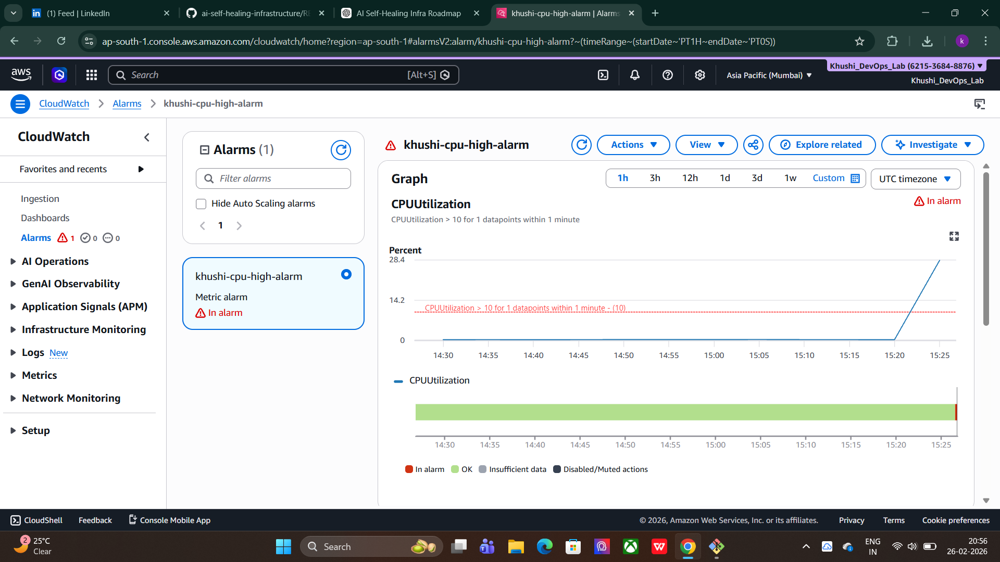
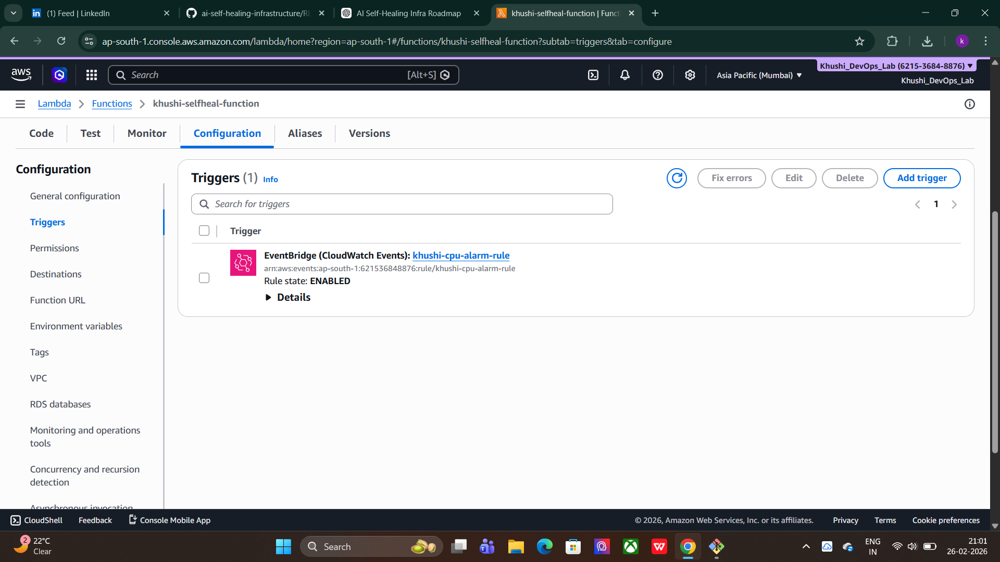
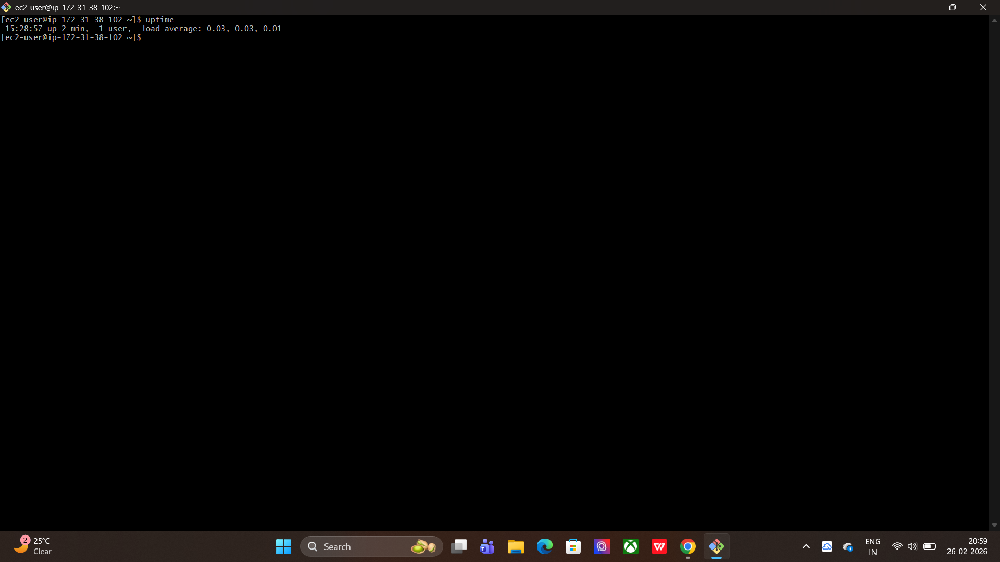

# 🚀 AI-Based Self-Healing Infrastructure on AWS

## 📌 Overview

Built a self-healing cloud infrastructure that automatically detects high CPU usage on an EC2 instance and triggers recovery using AWS Lambda.

The system eliminates manual intervention and reduces downtime.

---

## 🛠 Tech Stack

- Amazon EC2 (Amazon Linux 2023)
- Docker (Nginx container)
- Amazon CloudWatch
- Amazon SNS
- AWS Lambda
- GitHub

---

## 🏗 Architecture Flow

User Traffic  
↓  
EC2 (Docker - Nginx)  
↓  
CloudWatch monitors CPU  
↓  
Alarm triggers (>80%)  
↓  
Lambda executes  
↓  
EC2 auto-reboots  

---

## ⚙️ Implementation Steps

### 1️⃣ Launch EC2
- Created t2.micro instance (ap-south-1)
- Configured security group (22, 80)
- Connected via SSH

### 2️⃣ Install Docker & Deploy App
```bash
sudo dnf install docker -y
sudo systemctl start docker
docker run -d -p 80:80 nginx
```

### 3️⃣ Configure CloudWatch Alarm
- Monitored CPUUtilization
- Threshold: > 80%
- Triggered via SNS

### 4️⃣ Create Lambda Auto-Heal Function

```python
import boto3

ec2 = boto3.client('ec2')

INSTANCE_ID = "YOUR_INSTANCE_ID"

def lambda_handler(event, context):
    ec2.reboot_instances(
        InstanceIds=[INSTANCE_ID]
    )
    return "EC2 Instance Rebooted Successfully"
```

- Added CloudWatch alarm as trigger

---

## 🧪 Self-Healing Test

Simulated CPU spike:

```bash
yes > /dev/null &
```

Result:
- Alarm triggered
- Lambda executed
- EC2 rebooted automatically
- Verified using `uptime`

---

# 📸 Screenshots

## 🔔 CloudWatch Alarm Triggered


## ⚡ Lambda Trigger Connected


## 🔄 EC2 Auto Reboot Proof


---

## 🎯 Outcome

✔ Real-time monitoring  
✔ Automatic failure detection  
✔ Automated recovery  
✔ Zero manual intervention  

---

## 🚀 Future Improvements

- Restart Docker instead of full reboot
- Add Auto Scaling Group
- Slack alert integration
- Terraform (Infrastructure as Code)
